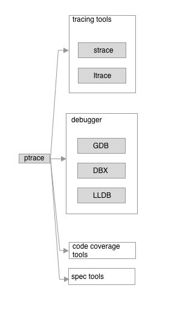

# HelloPtrace

[TOC]

## 1、介绍ptrace

ptrace函数是Linux、BSD等操作系统上提供一个系统调用。在MacOS的man文档描述，如下

> **ptrace**() provides tracing and debugging facilities. It allows one process (the tracing process) to control another (the traced process). Most of the time, the traced process runs normally, but when it receives a signal (see sigaction(2)), it stops. The tracing process is expected to notice this via wait(2) or the delivery of a SIGCHLD signal, examine the state of the stopped process, and cause it to terminate or continue as appropriate. **ptrace**() is the mechanism by which all this happens.

简单理解上面这段话的含义：

* ptrace提供跟踪和调试的能力，允许一个进程（tracing process）来控制另外一个进程（traced process）
* traced process大部分时间都是正常运行，除了它收到信号，它会停下来。tracing process通过wait函数或者发送SIGCHLD信号，检查已暂停进程的状态，并允许traced process终止或者继续运行。

[这篇文章](https://www.linuxjournal.com/article/6100?page=0,1)提到一些调试工具，都使用ptrace函数，如下图

